<div align="center">
 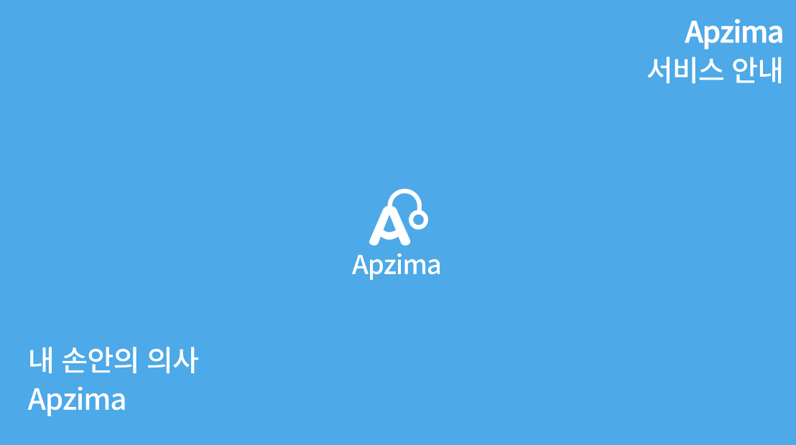
</div>


<div align="center">


### 팀명 : 컴백홈

| &nbsp;&nbsp;&nbsp;&nbsp;&nbsp;&nbsp;&nbsp;&nbsp;&nbsp;&nbsp; 오다혜 &nbsp;&nbsp;&nbsp;&nbsp;&nbsp;&nbsp;&nbsp;&nbsp;&nbsp;&nbsp; | &nbsp;&nbsp;&nbsp;&nbsp;&nbsp;&nbsp;&nbsp;&nbsp;&nbsp;&nbsp; 최준성 &nbsp;&nbsp;&nbsp;&nbsp;&nbsp;&nbsp;&nbsp;&nbsp;&nbsp;&nbsp; | &nbsp;&nbsp;&nbsp;&nbsp;&nbsp;&nbsp;&nbsp;&nbsp;&nbsp;&nbsp; 김다슬 &nbsp;&nbsp;&nbsp;&nbsp;&nbsp;&nbsp;&nbsp;&nbsp;&nbsp;&nbsp; | &nbsp;&nbsp;&nbsp;&nbsp;&nbsp;&nbsp;&nbsp;&nbsp;&nbsp;&nbsp; 이지웅 &nbsp;&nbsp;&nbsp;&nbsp;&nbsp;&nbsp;&nbsp;&nbsp;&nbsp;&nbsp;
|:---:|:---:|:---:|:---:|  
| - 팀장 <br> - Front-end  <br> - [GitHub](https://github.com/devohda) | - Back-end <Br> - [GitHub](https://github.com/backtony) | - AI <br> - [GitHub](https://github.com/Daseull) | - AI <br> - [GitHub](https://github.com/papago2355)

</div>

### Languages


<br>

### Technologies


<br>
 
### Collaboration Tool


<br>

---

<br>

# 📝 목차
- [API 문서](#api)
- [아키텍처](#structure)
- [주요 기능](#feat)
- [결과물](#outputs)
- [협업 방식](#notion)
- [성과](#result)


</details>

<br>

# 📋 API 문서  <a name = "api"></a>

<details>
   <summary> 본문 확인 (👈 Click)</summary>
<br />

[API 문서 링크](http://ec2-3-37-4-131.ap-northeast-2.compute.amazonaws.com:8080/docs/index.html)  
위 링크가 동작하지 않는다면 AWS를 내린 상태이므로 아래 명령어를 통해 확인할 수 있습니다.  
```sh
# MAC 기준
./gradlew clean build
```
위 명령어를 통해 빌드 후 build/docs/asciidoc/index.html 위치에 있는 파일을 여시면 확인하실 수 있습니다.  


</details>

<br>


</details>

<br>

# 🛠 아키텍처  <a name = "structure"></a>

<details>
   <summary> 본문 확인 (👈 Click)</summary>
<br />

<div align="center">
 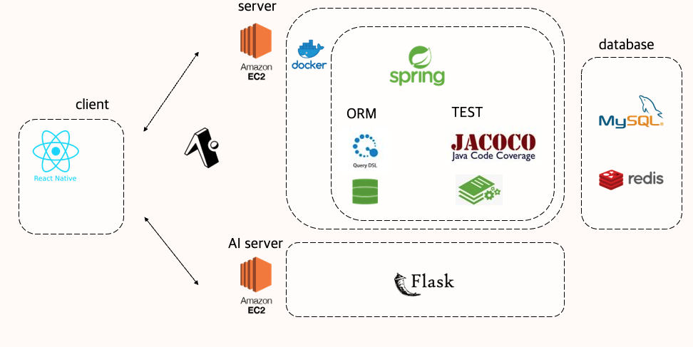
</div>

+ 프론트
    - 크로스 플랫폼을 지원하는 react native를 사용하여 IOS, Android 앱 제작
    - react-navigation을 사용하여 어플의 구조 설계
    - context api를 사용하여 상태관리
    - 증상 통계 차트는 victory-native를 사용
+ 백엔드
    - Spring 기반 서버
    - DDD 기반 설계
    - 데이터 접근 기술은 JPA와 복잡한 동적 쿼리의 경우 Querydsl 사용
    - Spring RSET Docs를 사용하여 API 문서화
    - 약 250개의 단위, 통합 테스트
    - Jacoco를 사용하여 테스트 커버리지 측정
    - DB는 MySQL과 Rredis 사용
+ AI
    - Flask 기반 API 서버

</details>

<br>


</details>

<br>


# 💎 주요 기능 <a name = "feat"></a>


<details>
   <summary> 본문 확인 (👈 Click)</summary>
<br />

<div align="center">
 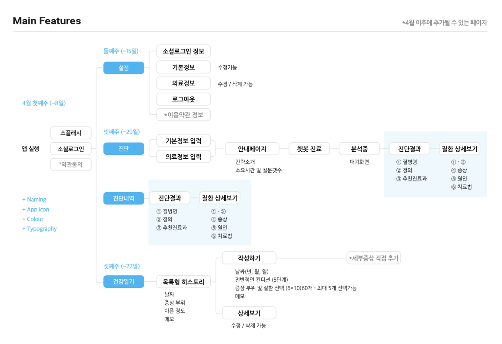
</div>

### 채팅 기반 AI 의료 진료
+ 의의
    - 거동이 불편하거나, 병원을 방문하기에 시공간적 여유가 없는 경우 AI와의 채팅을 통해서 자신의 증상과 관련된 병을 분석 받을 수 있음.
+ 기능
    - 자신의 신체적인 정보(키, 몸무게 등) 및 진단 시 필요한 정보를 사용자로부터 입력 받음.
    - 사용자가 입력한 정보에 기반하여 AI 모델이 분석 후 가장 유사도가 높은 병 3개 추천
    - AI가 분석한 병에 대한 각종 정보를 사용자에게 제공

### 진료 내역
+ 의의
    - 진료 받은 병명을 잊으면 다시 진료 받아야 하는 상황을 방지
+ 기능
    - 채팅 기반 AI 병명 예측을 통해 진단 받은 진료 내역을 자동으로 저장

### 아픔 증상 기록장
+ 의의
    - 통증이나 아픈 증상이 나타났을 때마다 기록을 함으로써 추후 병원 진료 진단 시 의사에게 제공함으로써 진단의 정확도를 높일 수 있도록 함
+ 기능
    - 증상 목록 중 해당하는 증상을 선택하거나 직접 증상을 기록하고 저장하면 선택한 날짜에 해당 정보가 저장됨
    - 기록 수정 및 삭제
    - 월별 증상 추적 시각화

> 추후 해당 프로젝트 확장 가능한 기능

+ 실제로 진단 받은 병명을 입력함으로써 기록했던 증상과 병 간의 관련성을 높이고, 이를 다시 피드백하여 AI 진료의 근거로 사용 및 진단 정확도를 높이는 기능
+ 진료를 보는 의사에게 자동으로 증상 기록이 연동되는 시스템


</details>

<br>


# 🎁 결과물  <a name = "outputs"></a>

<details>
   <summary> 본문 확인 (👈 Click)</summary>
<br />

### [시연 영상 링크](https://www.youtube.com/watch?v=v8aduUvC5pU)

<br>

## 앱

### 로그인
<div align="center">
 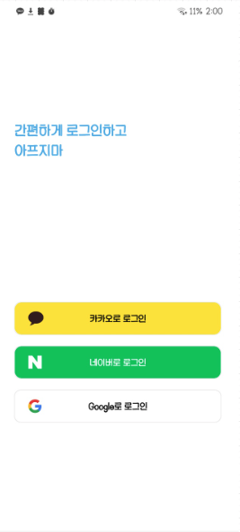
</div>

구글, 카카오, 네이버 로그인을 제공합니다.  
<br>


### 채팅 기반 AI 의료 진료
<div align="center">
 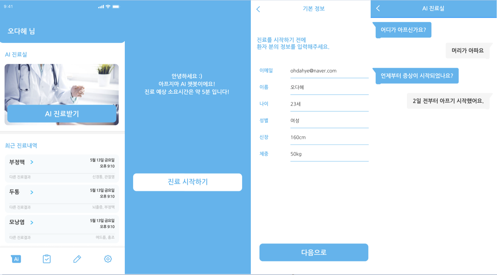
</div>

1. 메인 페이지 상단에 AI 진료 받기를 클릭합니다.
2. 최초 진료의 경우, 기본 정보를 입력받습니다.
3. AI와 채팅을 통해 진료를 받습니다.

<br>

<div align="center">
 
</div>

4. 사용자가 입력한 정보에 기반하여 AI 모델이 분석 후 가장 유사도가 높은 질병 3개의 간략한 정보를 제공합니다.
5. 각 질병을 클릭하게 되면 해당 질병의 상세한 정보를 제공합니다.  

<br>

### 진단 내역

<div align="center">
 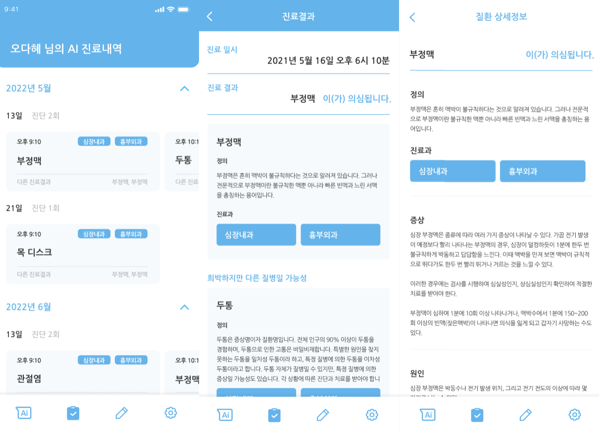
</div>

1. AI 의료 진료 내역은 자동으로 저장됩니다.
2. 하단 네비게이션 바의 왼쪽에서 2번째 아이콘을 클릭하면 진료 내역을 확인할 수 있습니다.
3. 진료 내역을 선택하면 질병 3개의 간략한 정보가 나오게 됩니다.
4. 각 질병을 선택하게 되면 해당 질병에 대한 상세한 정보를 제공합니다.


<br>

### 건강 일기
<div align="center">
 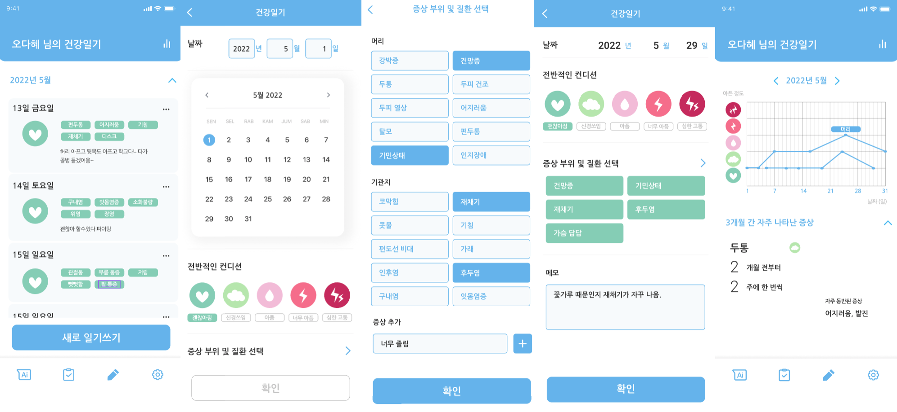
</div>

1. 하단 네이게이션 바의 왼쪽에서 3번째 아이콘을 클릭하면 건강 일기를 작성할 수 있습니다.
2. 날짜, 컨디션, 증상, 메모를 작성할 수 있습니다. 증상의 경우 기본적으로 앱에서 지원하는 카테고리가 존재하고 사용자가 직접 입력할 수도 있습니다.
3. 건강일기 데이터를 기반으로 증상을 추적하여 시각화 기능도 제공합니다.

<br>

### 마이페이지
<div align="center">
 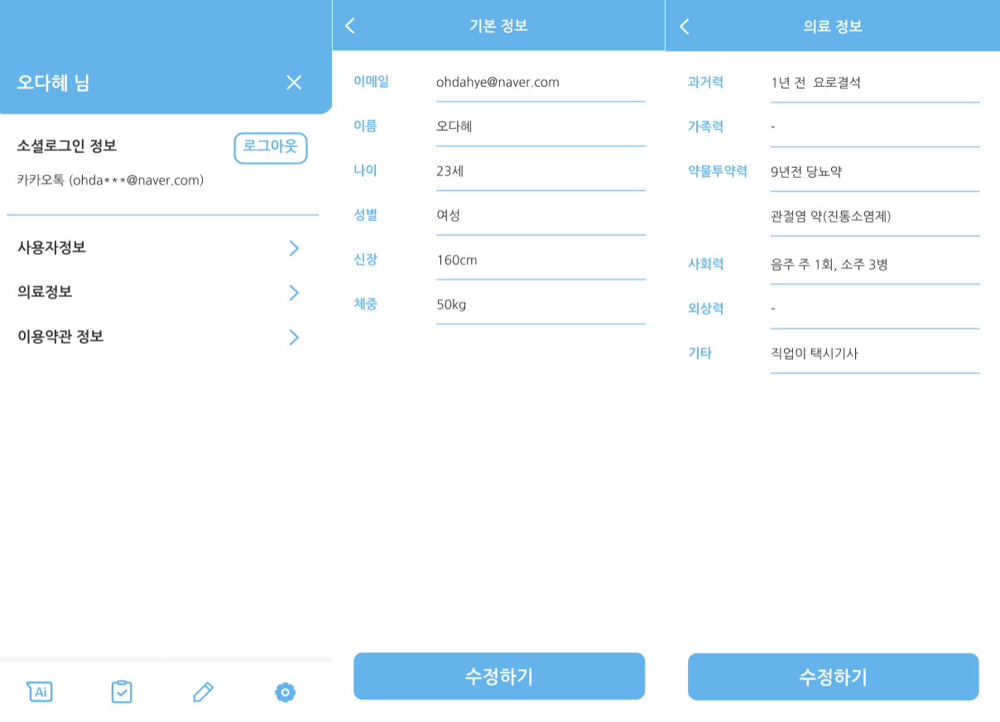
</div>

하단의 네비게이션 바에서 가장 오른쪽 아이콘을 클릭하면 메인페이지를 확인할 수 있습니다.  


</details>

<br>


# ⏰ 협업 방식 - Notion <a name = "notion"></a>

<details>
   <summary> 본문 확인 (👈 Click)</summary>
<br />

## 주 단위 미팅
<div align="center">
 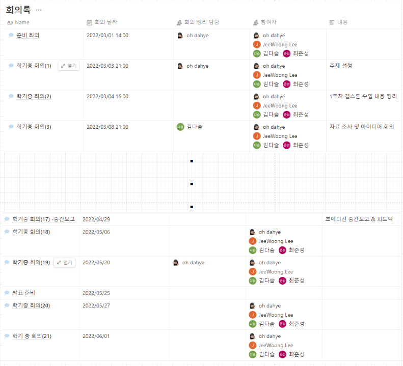
</div>

매주 금요일 구글 미트를 통해 현재까지 진행상황 및 이슈를 보고하고 이후 계획에 대해 정리합니다.  
<br>

## 진행 상황 공유

<div align="center">
 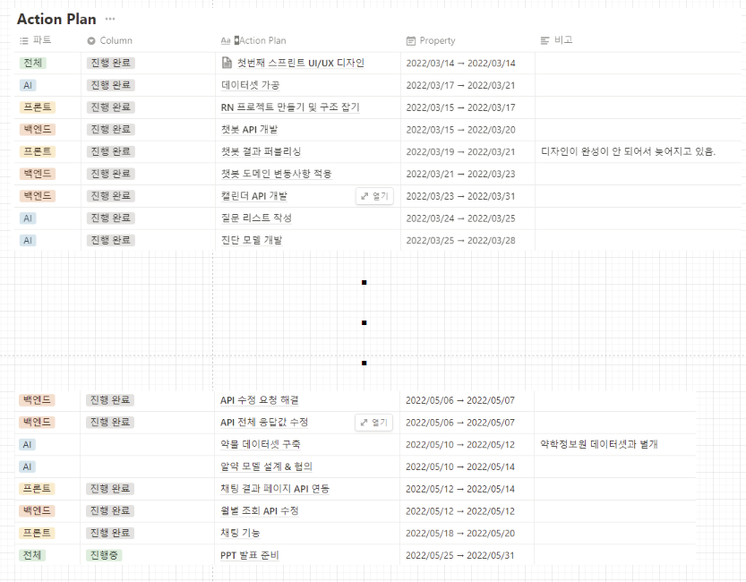
</div>

각자 진행 중인 작업을 노션에 명시하여 팀원들에게 진행 상황을 공유합니다.  
<br>

## 주차별 정리 및 회고

<div align="center">
 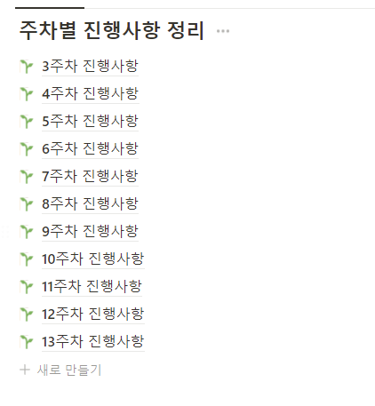
</div>

주차별 진행 사항 및 회고를 작성합니다.


</details>

<br>


# 📌 성과 <a name = "result"></a>

<details>
   <summary> 본문 확인 (👈 Click)</summary>
<br />

+ 교내 창의 경진대회 은상(2위) 수상


</details>

<br>

